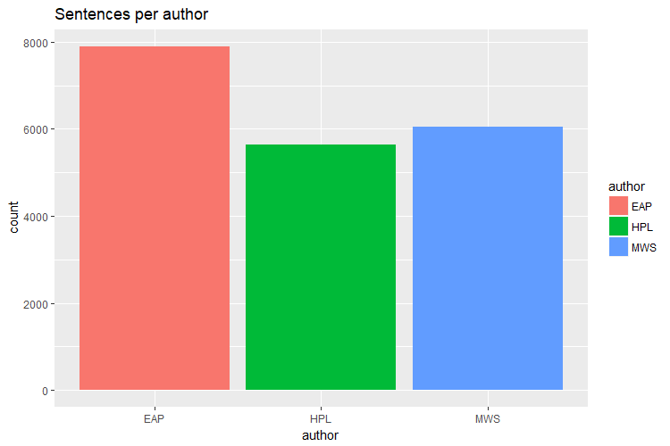
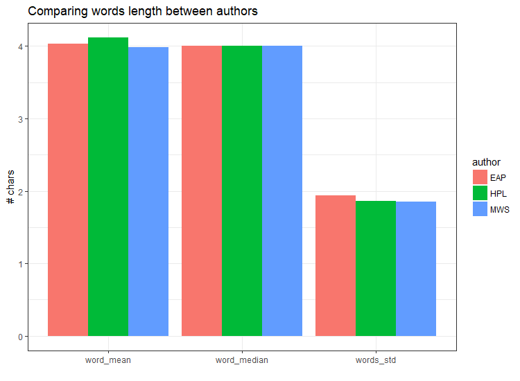
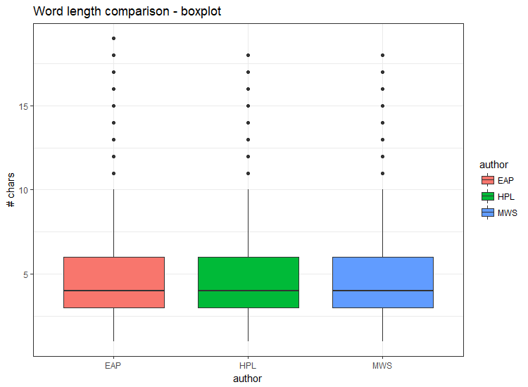
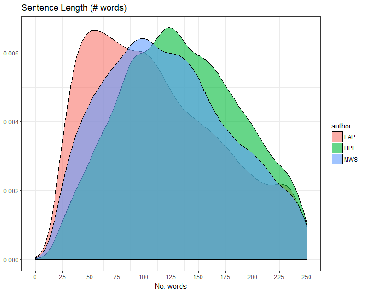
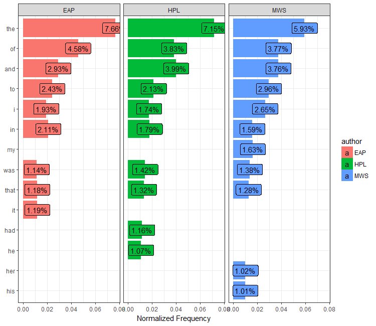
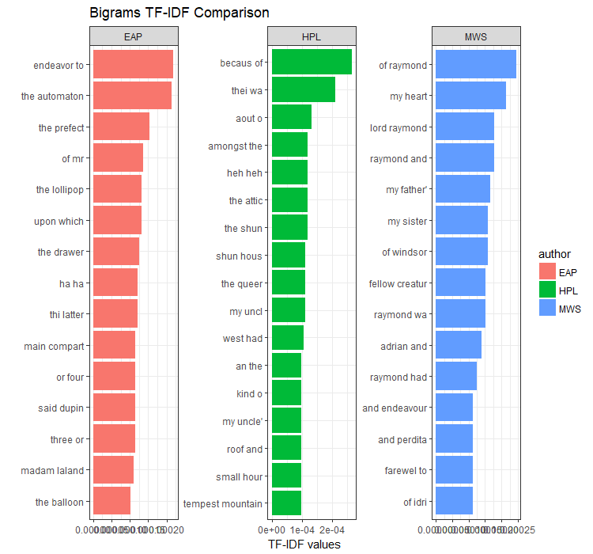
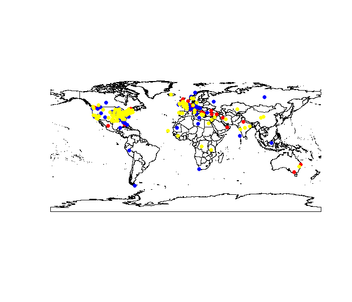

```{r setup, include=FALSE}
knitr::opts_chunk$set(echo = TRUE)
knitr::opts_chunk$set(warning = FALSE)
knitr::opts_chunk$set(message = FALSE)
```

<br>

### Spooky Authors Prediction

<br>


Loading relevant libraries and train set
```{r, message=FALSE, results='hide'}
# Load utility functions and relevant packages -----
pacman::p_load(dplyr, ggplot2, quanteda, typeless, readr, reshape2, rworldmap, magrittr, tidytext, glue, stringr, ggridges, tidyr)

# pacman::p_load_gh("trinker/entity")
Smisc::sourceDir("../code/utilities")

# read the data files 
train <- read_csv("../data/raw/train.csv")
```
<br>

Looking at the features and data dimensions:
```{r, message=FALSE}
# quick glimpse
glimpse(train)

# unnest the data (sentences broken into words)
train_un <- 
  train %>%
  unnest_tokens(word, text)
  
# useful msg
msg <- '\nThe train set has {nrow(train)} sentences, {nrow(train_un)} words'
glue(msg)
```
<br>
```{r, eval=FALSE}
# dependent variable
train %>% 
  ggplot(aes(x = author, fill = author)) +
  geom_bar() +
  labs(title = "Sentences per author")
```



<br>

### Minor cleaning

First we had a new feature of word length (# chars).
This feature might indicate some differences between the authors, for example **mean word length**.

Now, if there are any words of length 1, they will be removed. Only the word "I" will remain, since it might have an indication for personal writing style.

Another manipulation is word stemming.
Stemming is meant to unify words that differ in grammatical suffix ("sing", "singed, "singing" all have the same stem and can be unified). This process is mainly important for further analysis (for example tf-idf) to eliminate bias related to tenses and such.

```{r}
# unless I is appearent, other words of length 1 are ommited
train_un %<>% 
  mutate(len = nchar(word),
         one_char = if_else(len == 1, 1, 0)) %>%
  filter(!(one_char == 1 & !word %in% c("i", "I"))) %>% 
  select(-one_char)

# mind the filtration effect
pre <- 'Filtered words of length 1, excluding I:'
glue(paste(pre, msg))  
```
<br>

Word stemming:
```{r}
train_un %<>% mutate(stemmed = char_wordstem(word))
```

### Checking the length variable

First we see the mean word length per author:
```{r, eval = FALSE}
# Exploring word length per author
train_un %>% 
  mutate(len_stem = nchar(stemmed)) %>% 
  group_by(author) %>% 
  summarise(word_mean = mean(len_stem),
            word_median = median(len_stem),
            words_std = sd(len_stem)) %>% 
  melt(id.vars = "author") %>% 
  ggplot(aes(x = variable, y = value, fill = author)) +
  geom_col(position = "dodge") +
  labs(title = "Comparing words length between authors", 
       y = "# chars", 
       x = "") +
  theme_bw()
```


<br>

There seems to be only a small difference in **mean word length**.

Let's look draw a boxplot to better undestand word length per author:
```{r, eval = FALSE}
train_un %>% 
  ggplot(aes(x = author, y = len, fill = author)) +
  labs(title = "Word length comparison - boxplot", 
       y = "# chars") +
  geom_boxplot() +
  theme_bw()
```


<br>

The same conlusion is drawn when we look at the stemmed words length:

```{r}
# same comparison on the stemmed words
train_un %>% 
  mutate(len_stem = nchar(stemmed)) %>% 
  group_by(author) %>% 
  summarise(word_mean = mean(len_stem),
            word_median = median(len_stem),
            words_std = sd(len_stem))
```
<br>

Let's check the number of words in a sentence:

```{r}
train %>%
  mutate(len = str_length(text)) %>% 
  group_by(author) %>% 
  summarise(sen_mean = mean(len),
            sen_median = median(len),
            sen_std = sd(len))
```

This looks interesting, let's examine the entire distribution:
```{r, eval = FALSE}
train %>%
  mutate(len = str_length(text)) %>% 
  ggplot(aes(x = len, fill = author)) +
  geom_density(alpha = .6) +
  scale_x_continuous(breaks = seq(0, 250, 25), limits = c(0, 250)) +
  labs(title = "Sentence Length (# words)", x = "No. words", y = NULL) +
  theme_bw()
```


<br><br>

### Stop Words Analysis

Usually, where content-based analysis is desired stop words are redundant. However, in this problem, we would like to infer artistic writing style. Hence, stop words might actually be of great importance.


```{r}
# extract all stop words
stop_words <- 
  train_un %>% 
  filter(word %in% gsub("\\S+'\\S+", "", stopwords("english")))

# overall words for each author
words_per_author <- 
  train_un %>% 
  group_by(author) %>% 
  summarise(words = n())

# stop words per author
frequency <-
  stop_words %>%
  count(author, word)

# normalize by the total number of words per author
frequency <- left_join(frequency, words_per_author)
frequency %<>%
  mutate(ratio = n/words)
```

```{r, eval = FALSE}
# plot the most proportionally frequent stop words per author
frequency %>%
  arrange(desc(ratio)) %>%
  mutate(word = factor(word, levels = rev(unique(word)))) %>%
  top_n(30, ratio) %>%
  ggplot(aes(x = word, y = ratio, fill = author)) +
  geom_col() +
  geom_label(aes(label = scales::percent_format()(ratio)), hjust = .5) +
  facet_wrap(~author) +
  labs(x = NULL, y = "Normalized Frequency") +
  coord_flip() +
  theme_bw()
```


OK, so MWS appear to have female characters more frequently than the other authors. This explains the difference in frequency of "her" and "he".

<br><br>


### Throwing bigrams to the mix

Parsing the text into bigrams:
```{r}
# parse train to bigrams  
train_un_2 <- parseText(df = train, ng = 2L)

# stats
msg2 <- "\nThe train set has {nrow(train)} sentences, {nrow(train_un_2)} bigrams"
glue(msg2)
```
<br>

Now, we will stem the words in order to get a cleaner results for the tf-idf analysis:
```{r}
# perform word stemming: separate, stem, unite
bi_sep <- # separate
  train_un_2 %>%
  separate(bigram, c("word1", "word2"), sep = " ")

bi_sep %<>% # stem
  mutate(stem1 = char_wordstem(word1),
         stem2 = char_wordstem(word2))

train_un_2 <- # unite 
  bi_sep %>% 
  unite(bigram, stem1, stem2, sep = " ")
```
<br>

Let's plot the top 15 tf-idf bigrams per author:
```{r}
# tf-idf on bigrams
bi_tf_idf <- 
  train_un_2 %>%
  count(author, bigram) %>%
  bind_tf_idf(bigram, author, n) %>%
  arrange(desc(tf_idf))
```

```{r, eval = FALSE}
# plot tf-idf top n  
bi_tf_idf %>%
  arrange(desc(tf_idf)) %>%
  mutate(bigram = factor(bigram, levels = rev(unique(bigram)))) %>%
  group_by(author) %>%
  top_n(15, tf_idf) %>%
  ggplot(aes(bigram, tf_idf, fill = author)) +
  geom_col() +
  labs(title = "Bigrams TF-IDF Comparison", x = "", y = "TF-IDF values") +
  facet_wrap(~ author, ncol = 3, scales = "free") +
  coord_flip() +
  theme_bw()
```



Seems like we can disnguish the laugh notations of EAP ("ha ha") and HPL ("heh heh").

It is also clear that we must remove the name entities in order to get cleaner results, since unique character names themselves should not be used to identify author.

<br><br>


### Named Entity Recognition

<br>

We use **Apache's openNLP** to tag NERs. <br>
Currently two entities were tagged:

  + persons entities (names)
  
  + location entities (places)

The tagging wil ultimately allow us to filter out character names in a strightforward way. It will also allow us to explore the different locations each author writes about, hopefully revealing a pattern.

```{r, echo = TRUE, eval = FALSE}
# fetch data corpus
tr_corp <- read_csv("data/raw/train.csv") # train
ts_corp <- read_csv("data/raw/test.csv")  # test

# combine train and test to single corpus
tr_corp %<>% select(text)
ts_corp %<>% select(text)
corp <- rbind(tr_corp, ts_corp)

# person entities tagging
ppl_names <- person_entity(corp$text)
df_ppl <- data.frame(People = unique(unlist(ppl_names)), stringsAsFactors = FALSE)

# location entities tagging
loc_names <- location_entity(corp$text)
df_loc <- data.frame(Locations = unique(unlist(loc_names)), stringsAsFactors = FALSE)

# export the files
write_csv(df_ppl, "data/preprocessed/entities/person.csv")
write_csv(df_loc, "data/preprocessed/entities/location.csv")
```

<br><br>


### Locations

<br>

```{r, eval = FALSE}
# read the location files
mws_geocode <- read_csv("../data/preprocessed/locations/geocodes/mws.csv")
eap_geocode <- read_csv("../data/preprocessed/locations/geocodes/eap.csv")
hpl_geocode <- read_csv("../data/preprocessed/locations/geocodes/hpl.csv")
  
# plot the locations according to author
newmap <- getMap(resolution = "high")

plot(newmap, asp = 1)

# red indicates MWS
points(mws_geocode$lon, 
       mws_geocode$lat, 
       col = "red", cex = 1.1, pch = 19)

# blue indicates EAP
points(eap_geocode$lon, 
       eap_geocode$lat, 
       col = "blue", cex = 1.1, pch = 19)

# yellow indicates HPL
points(hpl_geocode$lon, 
       hpl_geocode$lat, 
       col = "yellow", cex = 1.1, pch = 19)
```


<br>